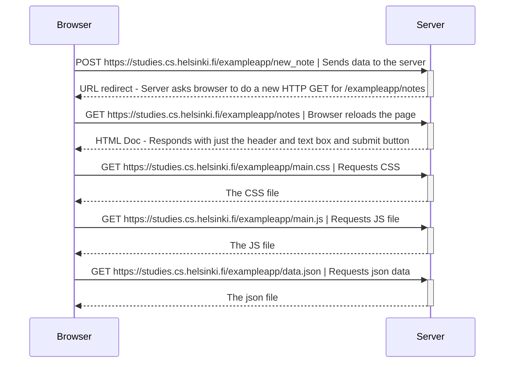

```mermaid
sequenceDiagram;
    Browser->>+Server: POST https://studies.cs.helsinki.fi/exampleapp/new_note | Sends data to the server
    Server-->>-Browser: URL redirect - Server asks browser to do a new HTTP GET for /exampleapp/notes
    Browser->>+Server: GET https://studies.cs.helsinki.fi/exampleapp/notes | Browser reloads the page
    Server-->>-Browser: HTML Doc - Responds with just the header and text box and submit button
    Browser->>+Server: GET https://studies.cs.helsinki.fi/exampleapp/main.css | Requests CSS
    Server-->>-Browser: The CSS file
    Browser->>+Server: GET https://studies.cs.helsinki.fi/exampleapp/main.js | Requests JS file
    Server-->>-Browser: The JS file
    Browser->>+Server: GET https://studies.cs.helsinki.fi/exampleapp/data.json | Requests json data
    Server-->>-Browser: The json file


```