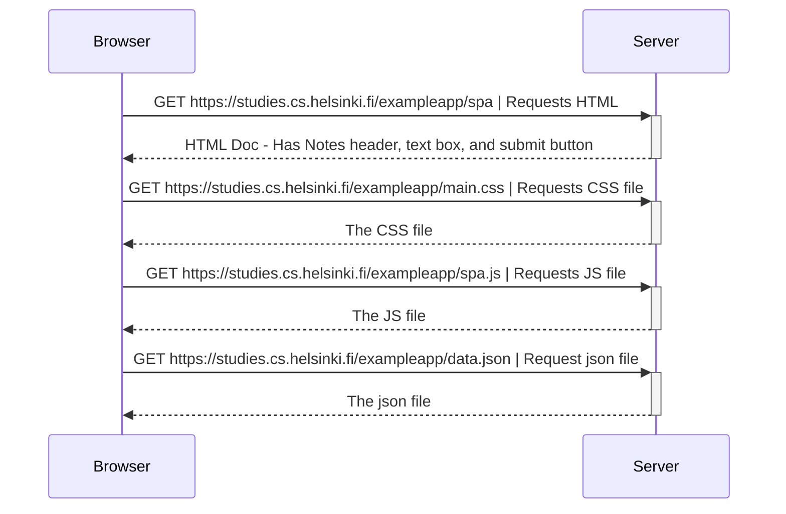

```mermaid
sequenceDiagram
    Browser->>+Server: GET https://studies.cs.helsinki.fi/exampleapp/spa | Requests HTML 
    Server-->>-Browser: HTML Doc - Has Notes header, text box, and submit button
    Browser->>+Server: GET https://studies.cs.helsinki.fi/exampleapp/main.css | Requests CSS file
    Server-->>-Browser: The CSS file
    Browser->>+Server: GET https://studies.cs.helsinki.fi/exampleapp/spa.js | Requests JS file
    Server-->>-Browser: The JS file
    Browser->>+Server: GET https://studies.cs.helsinki.fi/exampleapp/data.json | Request json file
    Server-->>-Browser: The json file
```